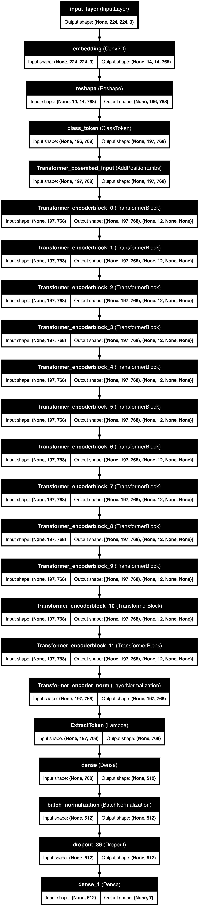
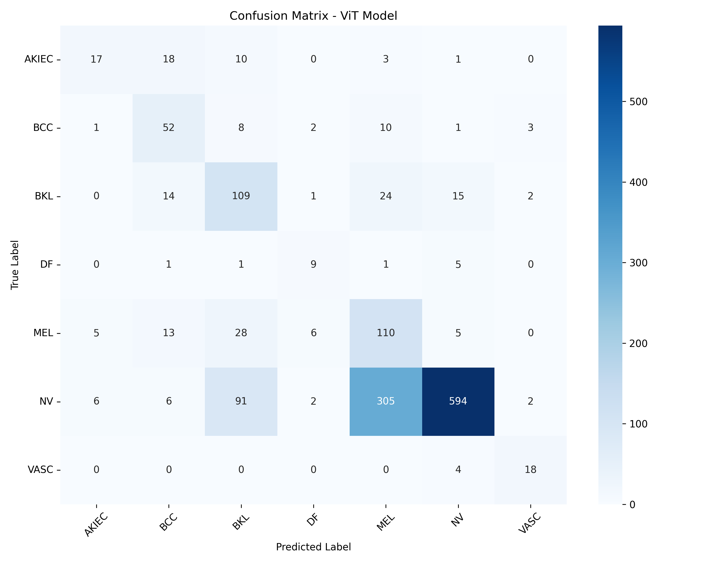
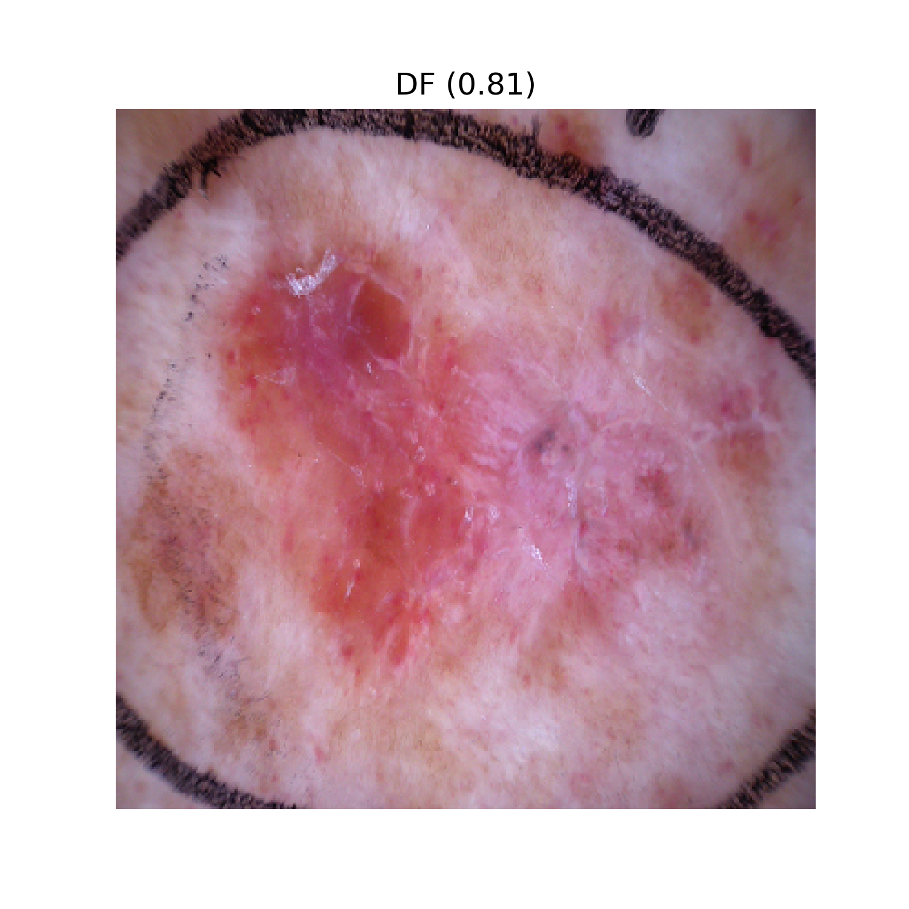
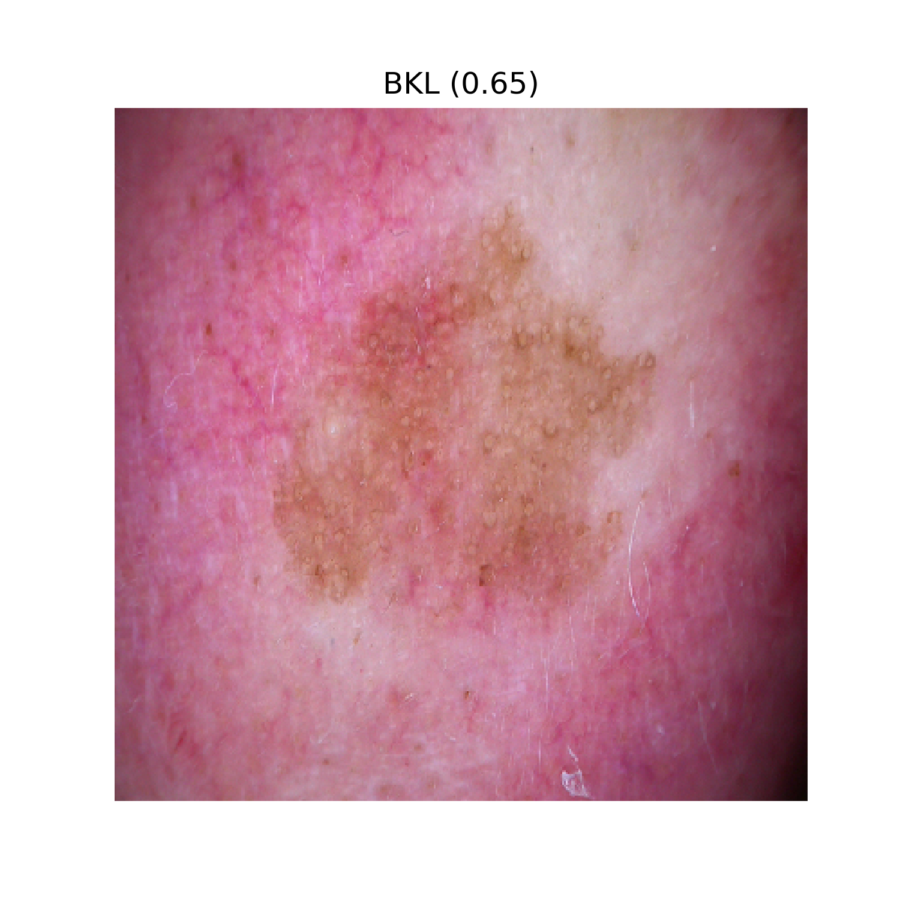
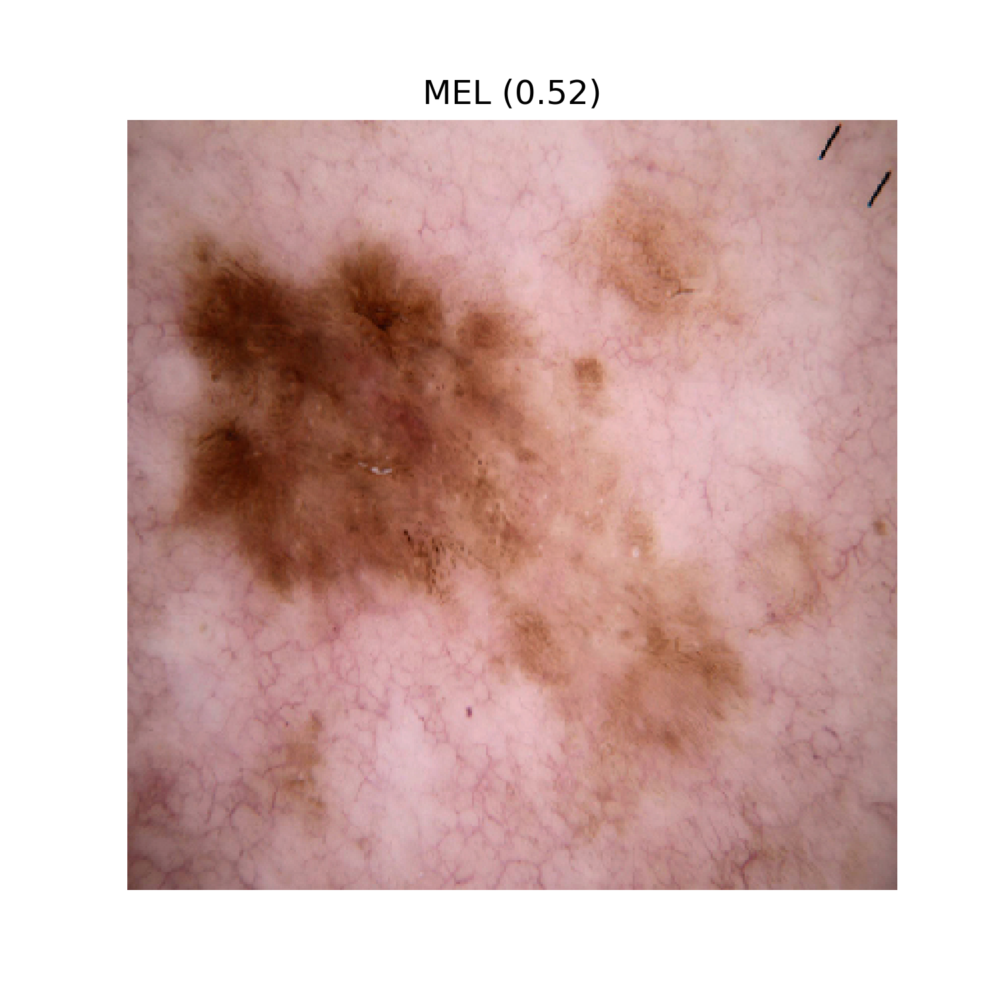
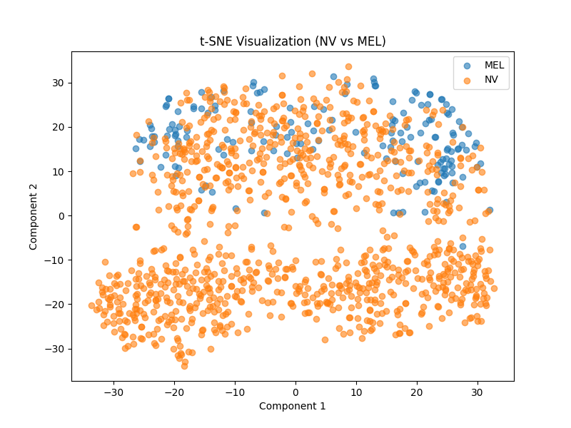

# 🩺 Skin Disease Detection using Vision Transformer (ViT)

<p align="center">
  
</p>

<p align="center">


</p>

<p align="center">
  <b>An Advanced Deep Learning Framework for Automated Skin Disease Classification using Vision Transformers (ViT)</b>
</p>

---

# 📌 Project Overview

Skin diseases are among the most common medical conditions worldwide, and **early diagnosis plays a crucial role in effective treatment**. Traditional diagnosis often depends on specialist expertise and can be time-consuming.

This project introduces an **AI-powered skin disease classification system** using **Vision Transformers (ViT)** to automatically classify dermoscopic skin images into multiple disease categories.

The framework incorporates advanced deep learning strategies such as:

* **Contrastive Fine-Tuning**
* **Hard Sample Mining**
* **Test-Time Augmentation (TTA)**
* **Attention Visualization (XAI)**
* **Embedding Separability Analysis**

to improve performance, robustness, and explainability.

---

# 🚀 Key Features

✅ **Vision Transformer (ViT)-Based Classification**
✅ **Contrastive Fine-Tuning** for enhanced feature learning
✅ **Hard Sample Mining** for better robustness on difficult samples
✅ **Test-Time Augmentation (TTA)** for stronger prediction accuracy
✅ **Attention Visualization** for explainable AI (XAI)
✅ **Embedding Separability Analysis using t-SNE**
✅ **Confusion Matrix & Prediction Analysis**
✅ **Model Evaluation & Comparison Pipeline**

---

# 🧠 Tech Stack

| Category                       | Technologies             |
| ------------------------------ | ------------------------ |
| **Programming Language**       | Python                   |
| **Deep Learning Framework**    | TensorFlow / Keras       |
| **Model Architecture**         | Vision Transformer (ViT) |
| **Data Processing**            | NumPy, Pandas            |
| **Visualization**              | Matplotlib               |
| **Machine Learning Utilities** | scikit-learn             |
| **Image Processing**           | OpenCV                   |

---

# 📂 Project Structure

```text
skin-disease-detection-vit/
│── src/                     # Training & evaluation scripts
│── results/                 # Predictions, confusion matrix, plots
│── models/                  # Model details
│── requirements.txt         # Project dependencies
│── .gitignore
│── README.md
```

---

# 🧪 Methodology

The project follows a structured deep learning pipeline for robust skin disease classification.

## 1️⃣ Dataset Preparation

* Image preprocessing
* Dataset cleaning
* Label preparation
* Data balancing strategies

## 2️⃣ Model Training

* Vision Transformer (ViT)
* Transfer Learning
* Fine-Tuning
* Focal Loss Experimentation
* Micro Fine-Tuning

## 3️⃣ Performance Enhancement

* Hard Sample Mining
* Contrastive Fine-Tuning
* Test-Time Augmentation (TTA)

## 4️⃣ Explainability & Analysis

* Attention Map Visualization
* Embedding Separability Analysis
* t-SNE Feature Visualization
* Confusion Matrix Evaluation

---

# 🏥 Disease Categories

The model is trained to classify multiple skin disease categories from dermoscopic images.

### Supported Classes

* **Melanoma (MEL)**
* **Melanocytic Nevus (NV)**
* **Basal Cell Carcinoma (BCC)**
* **Benign Keratosis (BKL)**
* **Dermatofibroma (DF)**
* **Actinic Keratoses (AKIEC)**
* **Vascular Lesions (VASC)**

---

# 📈 Results

## Confusion Matrix

<p align="center">
  
</p>

---

## Sample Predictions

<p align="center">
  
  
  
</p>

---

## Training Visualization

<p align="center">
  
</p>

---

# 📊 Performance Metrics

> Replace with your final model results.

| Metric        | Score |
| ------------- | ----- |
| **Accuracy**  | XX%   |
| **Precision** | XX    |
| **Recall**    | XX    |
| **F1 Score**  | XX    |

---

# ⚙️ Installation & Setup

## Clone Repository

```bash
git clone https://github.com/SahajDang/skin-disease-detection-vit.git
cd skin-disease-detection-vit
```

## Install Dependencies

```bash
pip install -r requirements.txt
```

## Run Model Training

```bash
python src/train_model.py
```

## Evaluate Model

```bash
python src/evaluate_model.py
```

---

# 📦 Dataset

This project uses the **ISIC (International Skin Imaging Collaboration)** dermoscopic skin image dataset.

📌 **Dataset is not included** in this repository due to size limitations.

---

# ⚠️ Model Weights

The trained model weights are excluded due to GitHub file size limitations.

**Best trained model:**

```text
best_vit_model.keras (~992 MB)
```

---

# 🔮 Future Improvements

* 🌐 Web Application Deployment
* 📱 Mobile App Integration
* ⚡ Real-Time Skin Disease Prediction
* 🧠 Better Explainability for Medical Trust
* ☁️ Cloud-Based Prediction API

---

# 👨‍💻 Author

## Sahaj Dang

**B.Tech in Data Science**
Machine Learning | Deep Learning | Software Development

GitHub: https://github.com/SahajDang

---

<p align="center">
⭐ If you found this project useful, consider giving it a star!
</p>

